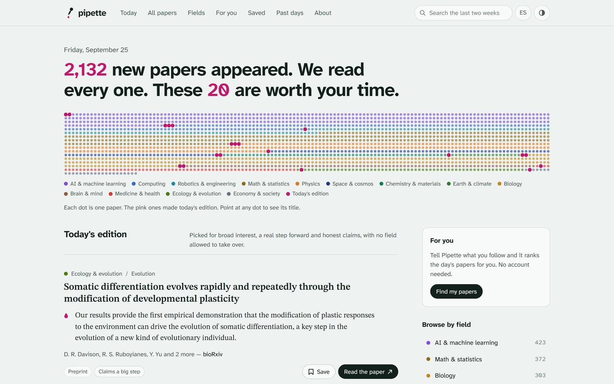
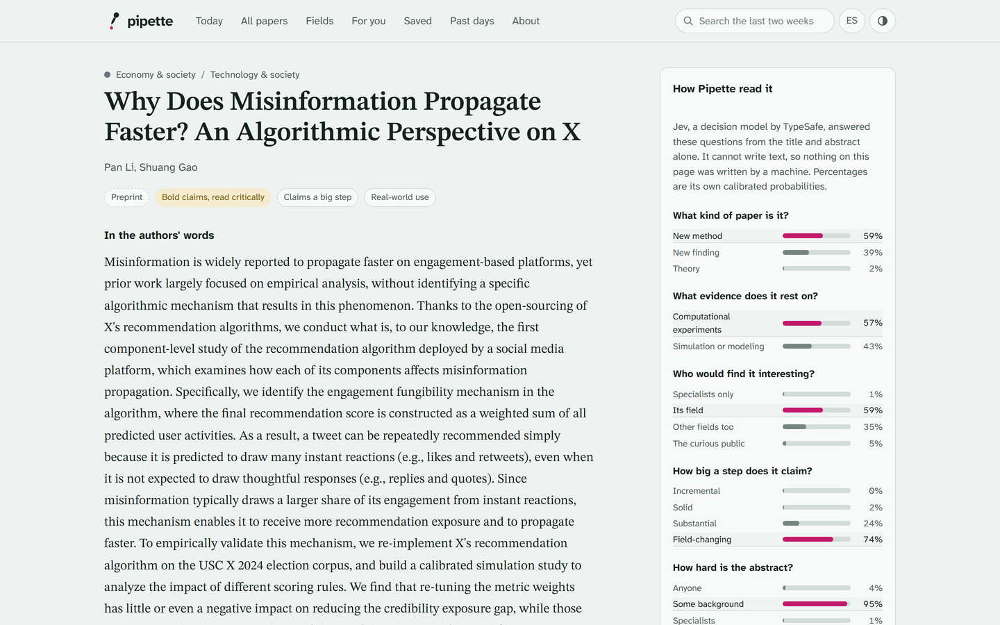
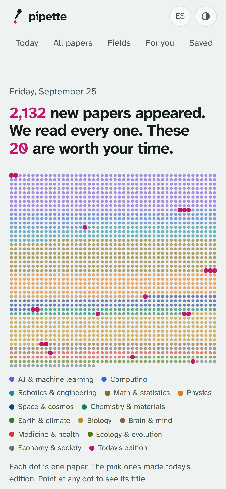
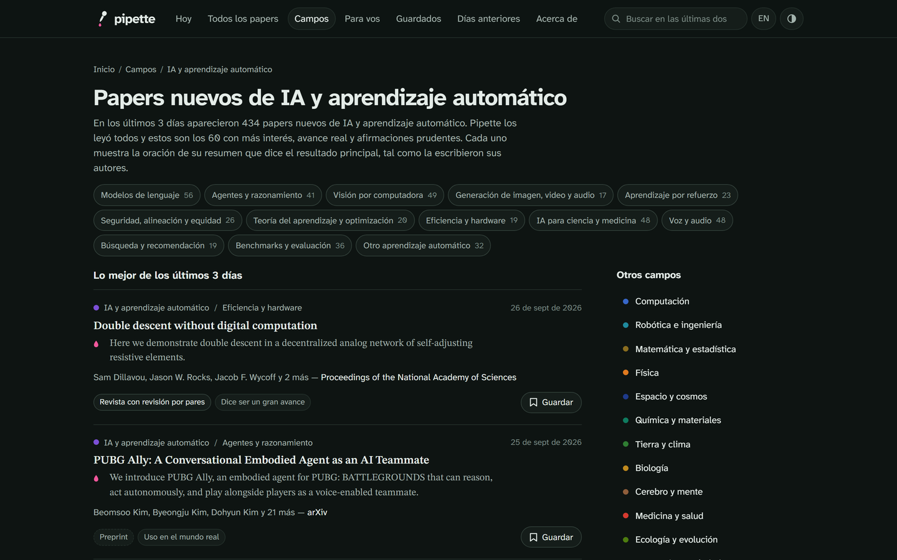
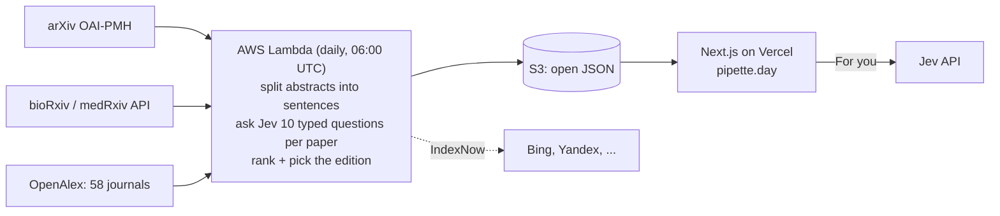

<p align="center">
  <a href="https://pipette.day">
    <picture>
      <source media="(prefers-color-scheme: dark)" srcset="docs/logo-dark.svg">
      
    </picture>
  </a>
</p>

<p align="center"><b>Today's science, one drop at a time.</b></p>

<p align="center">
  <a href="https://pipette.day">pipette.day</a> ·
  <a href="https://pipette.day/open-data">Open data</a> ·
  <a href="https://pipette.day/about#method">How it works</a> ·
  <a href="https://pipette.day/es">En español</a>
</p>

<p align="center">
  <a href="https://github.com/ferced/pipette/actions/workflows/ci.yml"></a>
  <a href="LICENSE"></a>
  <a href="https://pipette.day/open-data"></a>
  
</p>

---

Every day, thousands of new research papers appear, and AI is about to multiply that number. **Pipette reads every one of them each morning** (arXiv, bioRxiv, medRxiv and 58 leading journals) and publishes a short, diverse edition of the ones worth knowing about.

It never rewrites science. For each paper it quotes **the sentence of the abstract that states the main result, exactly as the authors wrote it**. The labels come from [Jev](https://typesafe.ai), a decision model that cannot generate text: it only chooses among options and reports calibrated probabilities, so it has nothing to hallucinate.

<p align="center">
  
</p>

## Principles

- **Every word is the authors'.** The machine picks and labels; scientists speak.
- **No ads, no tracking, no accounts.** The only cookie remembers your language. Saved papers and interests stay in your browser.
- **Honest about what a paper is.** Preprints are marked as not yet peer-reviewed. Abstracts that claim more than they show are flagged and never make the edition.
- **Every field gets a seat.** At most three papers per field in the daily edition.
- **Show the work.** The exact questions, every probability and the ranking rule are public, on each paper and in [`method.json`](https://pipette.day/data/v1/method.json).
- **Open data.** Everything Pipette produces is published as JSON, with the labels in the public domain.

## What's inside

| | |
|---|---|
| **Daily edition** | 8 to 20 papers across fields, chosen for broad interest, a real step forward and careful claims. |
| **The whole day** | Every paper, filterable by field, topic, kind of contribution, evidence, reading level, peer review and code. |
| **Paper pages** | The abstract with the main result and any admitted limitation highlighted, plus each of Jev's answers with its probabilities. |
| **For you** | Describe what you follow in your own words; Jev ranks the day's papers against that sentence. Works in English and Spanish. |
| **Fields and topics** | 13 fields and ~110 topics with always-fresh pages, RSS feeds and a public JSON API. |
| **Bilingual** | English and Spanish interface, light and dark themes, accessible and fast (Lighthouse 100 on SEO, accessibility and best practices). |

<table>
  <tr>
    <td width="62%"></td>
    <td width="38%"></td>
  </tr>
  <tr>
    <td colspan="2"></td>
  </tr>
</table>

## How it works



For each paper, Pipette sends the title and the abstract (as numbered sentences) to Jev with ten questions: topic, kind of contribution, main evidence, which sentence states the main result, which one admits a limitation, who would find it interesting, how big a step it claims, how hard it is to read, whether it overclaims, and whether it could affect people's lives directly. The answers are combined with a fixed formula:

```
rank = appeal + 0.9·advance + 0.4·practical − 2.4·max(0, hype − 0.5) − 0.25·level
```

Papers flagged for overclaiming (hype ≥ 0.6) are left out of the edition, and the edition allows at most 3 papers per field and 2 per topic. A weekday means about 2,000 papers, four million input tokens and roughly **US$0.17** of model usage.

## Open data

Everything is plain JSON, served from `https://pipette.day/data/v1/`:

| File | Contents |
|---|---|
| `index.json` | Every day with its counts |
| `days/<day>/edition.json` | The edition, with full records |
| `days/<day>/index.json` | Every paper of the day, compact records |
| `p/<id>.json` | One paper's full record, including every probability |
| `method.json` | The exact questions and ranking rule |

Pipette's labels and rankings are released under [CC0](https://creativecommons.org/publicdomain/zero/1.0/). Titles and abstracts keep their source's licence; closed-licence journal abstracts are not republished. See [pipette.day/open-data](https://pipette.day/open-data).

## Repository layout

```
ingest/    Python daily pipeline (runs on AWS Lambda, standard library + boto3)
  handler.py            entry point for Lambda and local runs
  pipette/sources.py    arXiv, bioRxiv, medRxiv and OpenAlex clients
  pipette/enrich.py     the questions Pipette asks Jev
  pipette/publish.py    ranking, edition and the JSON layout
  pipette/indexnow.py   tells search engines about new pages
shared/    taxonomy (fields, topics, kinds, evidence in EN/ES) and journal list
web/       Next.js 16 site (App Router, server-rendered, no CSS framework)
infra/     IAM policies, schedules and a setup script for AWS
qa/        Playwright end-to-end checks, screenshots and an SEO audit
```

## Run it locally

You need Python 3.12, Node 22 and a [TypeSafe API key](https://typesafe.ai) for Jev.

```bash
# 1. Read a day's papers and write the JSON to ingest/out
cd ingest
export JEV_API_KEY=...
python handler.py 2026-09-25 --out ./out        # add --limit 50 for a quick try

# 2. Serve the site against that folder
cd ../web
npm install
printf "DATA_DIR=../ingest/out\nNEXT_PUBLIC_DATA_BASE=/api/localdata\nJEV_API_KEY=%s\n" "$JEV_API_KEY" > .env.local
npm run dev
```

Open http://localhost:3000.

## Deploy your own

1. **AWS** (Lambda, S3, EventBridge Scheduler):
   ```bash
   JEV_API_KEY=... BUCKET=your-pipette-data ./infra/setup.sh
   ```
   After changing `ingest/`, rebuild with `ingest/package.sh` and upload with `aws lambda update-function-code`.
2. **Vercel**: import `web/` as a Next.js project and set `DATA_URL` (your bucket's URL) and `JEV_API_KEY` (used only by For you). `next.config.ts` proxies `/data/*` to the bucket.
3. Point your domain at Vercel and submit `/sitemap.xml` to Google Search Console.

Change `SITE` in `web/lib/entry.ts` and `ingest/pipette/indexnow.py` to your own domain.

## Checks

```bash
python qa/e2e.py https://pipette.day      # 24 end-to-end checks with Playwright
python qa/seo_audit.py https://pipette.day "/,/f/ai,/p/<id>"
```

## Credits

Made and kept free by [Ferced](https://ferced.com), a software studio from Buenos Aires.

Thank you to arXiv for use of its open access interoperability. Paper metadata also comes from [bioRxiv](https://www.biorxiv.org), [medRxiv](https://www.medrxiv.org) and [OpenAlex](https://openalex.org). Labels are produced with [Jev by TypeSafe](https://typesafe.ai). Typography: [STIX Two](https://www.stixfonts.org) for the authors' words and [Atkinson Hyperlegible Next](https://www.brailleinstitute.org/freefont/) for everything Pipette says.

## License

Code: [MIT](LICENSE). Data produced by Pipette: [CC0 1.0](https://creativecommons.org/publicdomain/zero/1.0/).
